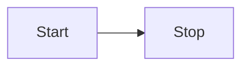

Hello! :tada:

**Test markdown features...**

## H2

followed by some text

### H3

followed by some text

#### H4

followed by some text

##### H5

followed by some text

###### H6

followed by some text

## Autolink literals

<www.example.com>, <https://example.com>, and <contact@example.com>.

## Test Footnote

A note[^1]

[^1]: Big note.

## Strikethrough

~one~ or ~~two~~ tildes.

## Table

| a | b  |  c |  d  |
| - | :- | -: | :-: |

## Tasklist

* [ ] to do
* [x] done

Auto-detected link: <https://giscus.vercel.app>

Can render `inline code`, *italics*, **strong**, :smile:

> here is blockquote
> test `inline code` *italics* **strong** :smile:

Lorem ipsum dolor sit amet, consectetur adipiscing elit. Duis id sem purus, eu commodo tortor. Donec malesuada ultricies dolor a eleifend. In hac habitasse platea dictumst. Vivamus a faucibus ligula. Nullam molestie tristique arcu, eu elementum metus ultricies sed. Aenean luctus congue lectus, vitae semper erat rhoncus non. Nulla facilisi.

Horizontal rule:

------

|Table Header 1|Table Header 2           |
|--------------|-------------------------|
|Content       | <https://github.com/laymonage/giscus>       |
|Content       |<http://github.com:\><te>|
I'm below the table.

A table with an empty cell and unaligned indenting.

|Table Header 1|Table Header 2|
|--------------|--------------|
|Content  |  Content        |
|Content       |      |

```js
var test = function this_is(){
  console.log("language declared as 'js' instead");
}
```

```diff
- print('hello world')
+ print('Hello, world!')
```

<https://github.com/giscus/giscus/blob/32bbb29c460f537946aca611f6faf55d318b26ab/lib/utils.ts#L34-L43>

<https://github.com/giscus/giscus/blob/72fac059a3ee54e0c3782cb362987c9801df068e/services/github/getAppAccessToken.ts#L31-L47>


Test from <https://github.com/suan/github-flavored-markdown-test>

### Mermaid



### Math

```math
L = \frac{1}{2} \rho v^2 S C_L
```
